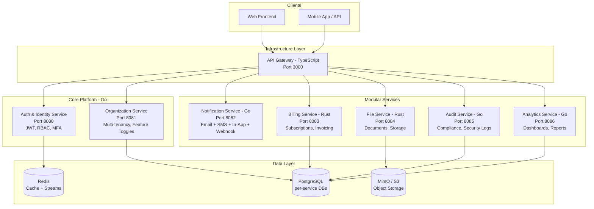

# Microservices Platform

A focused, multi-tenant SaaS platform for organizations (hospitals, schools, businesses) to manage their operations. Built with a polyglot stack (Go, Rust, TypeScript) to demonstrate scalable microservices patterns.

## Architecture

The platform consists of 8 focused services enabling organizations to choose modules according to their needs (multi-tenancy with feature toggles).



## Features

- **Multi-Tenancy:** First-class support for organizations with strict data isolation.
- **Module System:** Organizations enable only the services they need (e.g., Hospital = Auth+Files+Audit).
- **Polyglot Stack:**
  - **Go (Gin):** High-throughput core services (Auth, Org, Notification, Audit, Analytics).
  - **Rust (Axum):** Safety-critical and high-performance services (Billing, File).
  - **TypeScript (Express):** Flexible API Gateway layer.
- **Observability:** Full OpenTelemetry tracing, Prometheus metrics, and Grafana dashboards.
- **Security:** "Shift-left" security with SAST, DAST, and container scanning in every build.

## Prerequisites

- Go 1.22+
- Rust 1.75+
- Node.js 20+
- Podman & Podman Compose
- Git

## Quick Start

1. **Clone the repository:**
   ```bash
   git clone <repo-url>
   cd microservices-platform
   ```

2. **Start Infrastructure:**
   ```bash
   make infra-up
   ```

3. **Run Services (Dev Mode):**
   ```bash
   make services-up
   ```

## Documentation

- [Project Tracker](PROJECT_TRACKER.md)
- [Architecture Vision](docs/architecture/VISION.md)
- [Development Guide](docs/guides/DEVELOPMENT.md)
- [Security Testing](docs/guides/SECURITY.md)

## License

[License Name]
