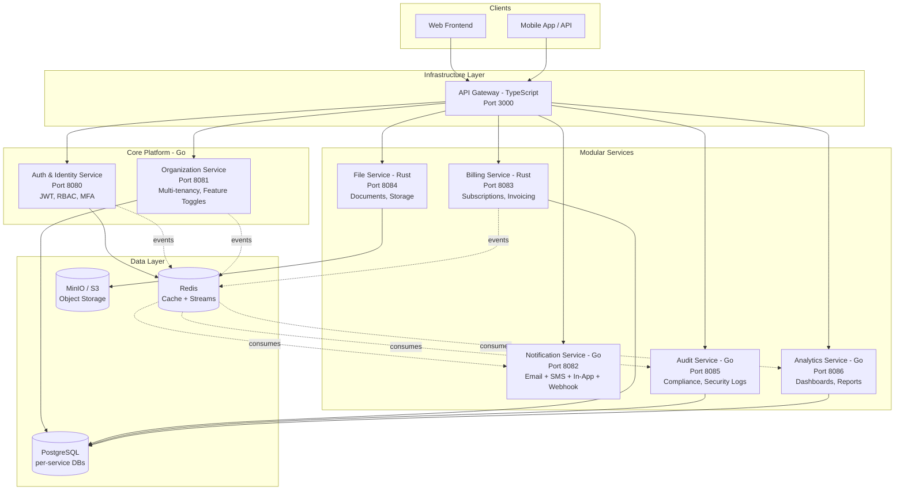

# Focused Microservices Platform

## Why This Architecture

**Goal:** A multi-tenant SaaS where organizations (hospitals, schools, businesses) sign up, choose the modules they need, and get a fully managed platform — while showcasing real-world microservices skills on GitHub.

**Design Principles:**
- **8 services, not 19** — completeness > breadth. Every service is fully built, tested, and documented.
- **Multi-tenancy as core concept** — organizations are first-class citizens with data isolation, feature toggles, and plan-based limits.
- **Module-aware gateway** — orgs only access services they've enabled. No code changes per customer.
- **Polyglot stack preserved** — Go (5 services) + Rust (2 services) + TypeScript (1 service) shows breadth.
- **Same quality bar** — shared libs, OpenTelemetry, Redis Streams, security testing, CI/CD.

## 8-Service Architecture



### Port Allocation

| Port | Service | Language |
|------|---------|----------|
| 3000 | API Gateway | TypeScript/Express |
| 3001 | Frontend | React/TypeScript |
| 8080 | Auth & Identity Service | Go/Gin |
| 8081 | Organization Service | Go/Gin |
| 8082 | Notification Service | Go/Gin |
| 8083 | Billing Service | Rust/Axum |
| 8084 | File Service | Rust/Axum |
| 8085 | Audit Service | Go/Gin |
| 8086 | Analytics Service | Go/Gin |
| 5432 | PostgreSQL (shared dev instance) | — |
| 6379 | Redis | — |
| 9000 | MinIO (S3-compatible storage) | — |
| 16686 | Jaeger UI | — |
| 9090 | Prometheus | — |
| 3002 | Grafana | — |

## Module System — How Organizations Choose Services

The **Organization Service** manages which modules each org has enabled. The **API Gateway** enforces this on every request.

```json
{
  "organization": {
    "id": "org_abc123",
    "name": "City General Hospital",
    "plan": "professional",
    "modules": {
      "notifications": { "enabled": true, "channels": ["email", "sms"] },
      "billing": { "enabled": true },
      "file_management": { "enabled": true },
      "audit_logging": { "enabled": true },
      "analytics": { "enabled": false }
    }
  }
}
```

**How it works:**
1. Every request includes the org's tenant ID (from JWT or API key)
2. Gateway fetches org's module config from Organization Service (cached in Redis)
3. If the target module is disabled, Gateway returns `403 Module Not Enabled`
4. If enabled, request is forwarded with tenant context headers

**Example org configurations:**

| Organization Type | Typical Modules |
|-------------------|-----------------|
| Hospital | Auth + Notifications + Files + Audit (HIPAA) |
| School | Auth + Notifications + Files + Analytics |
| Small Business | Auth + Billing + Notifications + Analytics |
| Enterprise | All modules enabled |

## Service Details

### 1. API Gateway (TypeScript/Express — Port 3000)

- Request routing with **module-aware gating** (checks org's enabled modules)
- JWT validation and tenant context extraction
- Rate limiting (per-org configurable limits)
- CORS, security headers
- Request/response logging
- OpenTelemetry instrumentation
- Correlation ID propagation to all downstream services
- Circuit breaker for each downstream service
- Health aggregation endpoint (`/health` checks all services)

### 2. Auth & Identity Service (Go/Gin — Port 8080)

The identity backbone. Handles everything authentication and authorization — no separate permission service needed.

- JWT access tokens (15min) + refresh tokens (7d)
- MFA via TOTP (Google Authenticator compatible)
- **RBAC built-in** with roles: `org_owner`, `org_admin`, `manager`, `member`, `viewer`
- User CRUD scoped to organization (multi-tenant)
- Password policies (min length, complexity, history)
- Account lockout after N failed attempts
- Login history and active sessions
- API key management for service-to-service auth
- Events via Redis Streams: `user.created`, `user.login`, `user.role_changed`, `auth.failed`

### 3. Organization Service (Go/Gin — Port 8081)

The heart of the platform. Manages multi-tenancy, feature toggles, and plans.

- **Tenant management**: org registration, settings, custom branding
- **Feature toggles**: enable/disable modules per org (stored in DB, cached in Redis)
- **Plan management**: free / starter / professional / enterprise
  - Plans define: max users, max storage, available modules, API rate limits
- Org member management (invite via email, remove, role assignment)
- Department/team structure within orgs
- Org-level settings (timezone, locale, notification preferences)
- Events: `org.created`, `org.updated`, `org.module_toggled`, `org.plan_changed`, `org.member_invited`

### 4. Notification Service (Go/Gin — Port 8082)

Unified notification engine. One service, four channels — replaces what was 4 separate services.

- **Email** channel: SMTP or SendGrid integration
- **SMS** channel: Twilio integration
- **In-app** channel: stored notifications with read/unread status
- **Webhook** channel: event delivery to external URLs
- Per-org customizable templates (Handlebars/Go templates)
- Per-user notification preferences (which channels, quiet hours)
- Delivery tracking, retry with exponential backoff
- Failed deliveries go to Dead Letter Queue
- Webhook URL validation (no internal IPs, no localhost — SSRF prevention)
- Events consumed: listens to events from all services, routes to appropriate channels

### 5. Billing Service (Rust/Axum — Port 8083)

Handles subscription billing and invoicing. Rust for performance and correctness on financial calculations.

- Subscription lifecycle: create, upgrade, downgrade, cancel
- Invoice generation (PDF rendered via file service)
- Usage metering: API calls, storage bytes, active users per org
- Payment integration: Stripe (primary), extensible to others
- Proration on plan changes
- Dunning management (failed payment retries, grace periods)
- Revenue reporting
- No card numbers in logs, sensitive data encrypted at rest
- Events: `invoice.created`, `payment.received`, `payment.failed`, `subscription.changed`

### 6. File Service (Rust/Axum — Port 8084)

Document and file management. Rust for safe, performant file handling.

- Upload/download with streaming (no full-file buffering)
- Storage backend: MinIO (S3-compatible, self-hostable)
- **Per-org isolation**: each org gets a separate bucket/prefix
- Per-org storage quotas (enforced by plan limits from Org Service)
- File type validation (allowlist, magic byte checking)
- Virus scanning hooks (ClamAV integration)
- Thumbnail generation for images
- Signed URLs for secure, time-limited downloads
- Events: `file.uploaded`, `file.deleted`, `file.accessed`

### 7. Audit Service (Go/Gin — Port 8085)

Immutable compliance logging. Critical for hospitals (HIPAA) and regulated industries.

- **Append-only** audit log (no updates, no deletes)
- Captures: who did what, when, from where, on which resource
- Per-org audit trails with retention policies
- Security event logging (failed auth, permission denied, suspicious activity)
- Export to CSV/JSON for compliance reporting
- Search/filter by date range, actor, action type, resource
- Consumes events from all other services automatically
- Tamper detection (hash chaining on log entries)

### 8. Analytics Service (Go/Gin — Port 8086)

Org-scoped dashboards and reporting. Replaces both Analytics + Reporting services.

- Pre-computed aggregations (hourly/daily cron jobs)
- Org dashboard: active users, API usage, storage trends, notification delivery rates
- Report generation: PDF/CSV export
- Custom date range queries
- Usage forecasting (simple trend analysis)
- Consumes events from all services for metrics

## Cursor Rules Strategy (3 Progressive Rules)

Same 3-rule strategy from the original plan, adapted for 8 services.

### Rule 1: `foundation-rules.mdc` (alwaysApply: true)

**Completeness:**
- NEVER create placeholder or stub files. Every file must contain working code.
- NEVER write functions with hardcoded/mock data. Connects to real infrastructure or doesn't exist.
- No commented-out code. Git has history.
- TODOs only with linked issue context (e.g., `// TODO(phase-2): add webhook retry -- not needed yet`).
- If a feature is too large, implement a WORKING subset, not stubs.

**Code Quality:**
- Max function length: 100 lines. Max file length: 500 lines.
- No magic numbers/strings. Named constants only.
- Every public function/method has a doc comment.
- No lint suppressions without justification.

**Shared Libraries — Mandatory (once they exist):**
- ALWAYS use `libs/go/pkg/logger` for logging. Never `fmt.Println` or direct `zerolog`.
- ALWAYS use `libs/go/pkg/errors` for error types. Never raw `fmt.Errorf`.
- ALWAYS use `libs/go/pkg/middleware` for auth, rate-limit, CORS, recovery, **tenant context**.
- ALWAYS use `libs/go/pkg/health` for health checks.
- ALWAYS use `libs/go/pkg/config` for configuration. Never direct `os.Getenv`.
- ALWAYS use `libs/go/pkg/database` for DB connections.
- ALWAYS use `libs/go/pkg/messaging` for Redis Streams. Never Pub/Sub.
- ALWAYS use `libs/go/pkg/tenant` for tenant-scoped operations.
- Equivalent rules for Rust (`libs/rust/`) and TypeScript (`libs/typescript/`).

**Security — Non-Negotiable:**
- Parameterized SQL ONLY.
- Validate and sanitize ALL user input at the handler layer.
- No secrets in code. All from config/environment.
- No `*` CORS origins.
- Service-to-service calls require API key authentication.
- Every outbound HTTP call has a timeout (30s default).
- Every Redis operation has a TTL.
- Log security events at WARN/ERROR level.

**Multi-Tenancy — Critical:**
- Every database query MUST include tenant_id in the WHERE clause.
- Every API response MUST be scoped to the requesting org.
- Never return data from one org to another. This is a security boundary.
- Tenant context extracted from JWT and propagated via middleware.

**API Standards:**
- Response format: `{"success": bool, "data": {...}, "message": "..."}`
- Error format: `{"success": false, "error": {"code": "ERROR_CODE", "message": "...", "details": "..."}}`
- All endpoints return proper HTTP status codes.
- All endpoints prefixed with `/api/v1/`.
- Input validation before business logic.

**Database:**
- Schema changes ONLY through numbered migration files (`NNN_description.sql`).
- Every migration reversible (up + down SQL).
- Never modify existing migrations.
- Every table has `id` (UUID), `tenant_id` (UUID), `created_at`, `updated_at`.
- Connection pooling (min 5, max 50).

**Infrastructure:**
- `Containerfile` (not `Dockerfile`). Multi-stage builds. Non-root user. Pinned base image versions.

**Testing:**
- Every handler: happy path + auth/validation error tests minimum.
- No function ships without at least one test.

**Communication:**
- Redis Streams with consumer groups. Never Pub/Sub.
- Event format: `{"id": UUID, "type": string, "version": int, "source": string, "tenant_id": string, "data": {...}, "metadata": {"correlation_id": "...", "timestamp": "..."}}`.
- Every consumer must be idempotent.

### Rule 2: `service-rules.mdc` (globs: `services/**/*`, `libs/**/*`)

**Go** (`*.go`):
- Gin for HTTP. Context propagation on all I/O functions.
- Error wrapping with codes. No `panic()` outside `cmd/main.go`.
- `uuid.UUID` for all IDs. JSON `snake_case`. Go `PascalCase`.
- Dependency injection via constructors. Graceful shutdown on SIGTERM.

**Rust** (`*.rs`):
- Axum 0.7+ for HTTP, tokio for async.
- No `unwrap()` outside tests. Use `?` or explicit match.
- `thiserror` for typed errors, `anyhow` at boundaries.
- `serde` for serialization. `sqlx` for database.

**TypeScript** (`*.ts`):
- Strict mode. No `any`. `async/await` only.
- `zod` for validation. Centralized error middleware.

**SQL Migrations**: `NNN_description.sql`. Indexes with table creation. `IF EXISTS` on drops.

**Compose/Infrastructure**: Healthchecks on every container. `restart: unless-stopped`. No hardcoded passwords. Named volumes.

### Rule 3: `production-rules.mdc` (alwaysApply: false → true at Phase 3)

Activated during production hardening:
- Zero TODOs in codebase.
- 80%+ test coverage. Full error path tests.
- Circuit breakers on all outbound calls.
- Full OpenTelemetry spans on every handler and outbound call.
- Prometheus metrics at `/metrics`.
- API response < 100ms p95. DB queries < 50ms average.
- All services pass OWASP ZAP scan with zero HIGH/CRITICAL.
- All containers pass Trivy scan with zero CRITICAL CVEs.
- Complete READMEs, OpenAPI specs, and runbooks.

## Project Structure

```
microservices-platform/
├── .github/workflows/            # CI/CD
├── .cursor/rules/                # 3 progressive Cursor rules
├── deploy/
│   ├── podman/
│   │   ├── compose.base.yml     # Postgres, Redis, MinIO, Jaeger, Prometheus, Grafana
│   │   ├── compose.core.yml     # Auth, Org, Gateway
│   │   ├── compose.services.yml # Notification, Billing, File, Audit, Analytics
│   │   ├── compose.security.yml # Kali, ZAP, Trivy
│   │   └── compose.dev.yml      # Dev tools (adminer, redis-commander)
│   ├── k8s/                     # Kubernetes manifests (Phase 3)
│   └── scripts/                 # Deploy/infra scripts
├── docs/
│   ├── architecture/
│   │   ├── VISION.md            # Single architecture vision doc
│   │   ├── ADR/                 # Architecture Decision Records
│   │   └── diagrams/
│   ├── api-specs/               # OpenAPI specs per service
│   ├── runbooks/                # Operational runbooks
│   └── guides/
│       ├── DEVELOPMENT.md       # Dev guide (incl. local workflow)
│       ├── SECURITY.md          # Security standards
│       └── MESSAGING.md         # Event-driven patterns
├── libs/
│   ├── go/
│   │   ├── pkg/
│   │   │   ├── logger/          # Structured logging (zerolog)
│   │   │   ├── errors/          # Standardized error types
│   │   │   ├── middleware/      # Auth, rate-limit, CORS, recovery, tenant context
│   │   │   ├── messaging/      # Redis Streams producer/consumer
│   │   │   ├── health/         # Health check framework
│   │   │   ├── config/         # Config loading (viper)
│   │   │   ├── database/       # DB connection, migrations, pooling
│   │   │   ├── cache/          # Redis cache abstraction
│   │   │   ├── tracing/        # OpenTelemetry integration
│   │   │   ├── metrics/        # Prometheus metrics
│   │   │   ├── httputil/       # Shared HTTP client (tracing, timeouts, retries)
│   │   │   ├── tenant/         # Multi-tenancy context, scoped queries
│   │   │   └── testing/        # Test helpers, fixtures, mocks
│   │   └── go.mod
│   ├── rust/                    # Shared Rust crate (built in Phase 2)
│   │   ├── common/             # Error types, config, logging
│   │   ├── messaging/          # Redis Streams for Rust
│   │   └── Cargo.toml
│   ├── typescript/             # Shared TS package (built in Phase 1)
│   │   ├── src/
│   │   │   ├── logger.ts
│   │   │   ├── errors.ts
│   │   │   ├── health.ts
│   │   │   └── tenant.ts
│   │   └── package.json
│   └── contracts/              # Shared API contracts (OpenAPI specs)
├── services/
│   ├── api-gateway/             # TypeScript/Express (port 3000)
│   ├── auth-service/            # Go/Gin (port 8080)
│   ├── organization-service/    # Go/Gin (port 8081)
│   ├── notification-service/    # Go/Gin (port 8082)
│   ├── billing-service/         # Rust/Axum (port 8083)
│   ├── file-service/            # Rust/Axum (port 8084)
│   ├── audit-service/           # Go/Gin (port 8085)
│   └── analytics-service/       # Go/Gin (port 8086)
├── frontend/                    # React/TypeScript (port 3001)
├── tests/
│   ├── e2e/                     # End-to-end tests
│   ├── contract/                # API contract tests
│   ├── load/                    # k6 load tests
│   └── security/                # Security & pentesting
│       ├── dast/                # OWASP ZAP configs
│       ├── sast/                # semgrep rules
│       ├── pentest/             # Kali attack scripts
│       │   ├── auth-attacks/    # JWT, brute force, credential stuffing
│       │   ├── injection/       # SQLi, XSS, command injection
│       │   ├── tenant-isolation/# Cross-tenant access attempts
│       │   ├── api/             # OWASP API Top 10
│       │   └── tls/             # TLS/SSL tests
│       ├── fuzz/                # Fuzz testing
│       ├── reports/             # Generated reports (.gitignored)
│       └── Makefile             # Security test runner
├── scripts/
│   ├── setup-dev.sh             # One-command dev setup
│   ├── init-databases.sh        # Create per-service databases
│   ├── create-service.sh        # Scaffold new service
│   ├── run-tests.sh             # Cross-service test runner
│   └── run-security-scan.sh     # One-command security scan
├── Makefile                     # Root-level commands
├── .env.example                 # Template (no real secrets)
├── .gitignore
└── README.md
```

### Standardized Service Template (Go)

```
services/<service-name>/
├── cmd/
│   └── main.go                  # Entry point, graceful shutdown
├── internal/
│   ├── config/                  # Service-specific config
│   ├── handlers/                # HTTP handlers
│   ├── service/                 # Business logic
│   ├── repository/
│   │   ├── postgres/            # PostgreSQL implementations
│   │   └── redis/               # Redis cache implementations
│   ├── models/                  # Domain models
│   └── migrations/              # SQL migrations
├── api/
│   ├── middleware/               # Service-specific middleware
│   └── routes.go                # Route registration
├── tests/
│   ├── unit/
│   ├── integration/
│   └── fixtures/
├── Containerfile                # Multi-stage, non-root, pinned base
├── Makefile
├── go.mod                       # References libs/go as local module
└── README.md
```

## Key Architecture Decisions

### 1. Multi-Tenancy via Shared Database with Row-Level Isolation

**Development:** Shared PostgreSQL instance with separate databases per service (e.g., `auth_db`, `org_db`, `billing_db`). Shared Redis with key prefixes.

**Production:** Separate database instances per service.

Every table includes `tenant_id` (UUID). Every query filters by it. Enforced by shared library middleware.

```go
// libs/go/pkg/tenant/context.go
// Middleware extracts tenant_id from JWT and injects into context.
// Repository layer automatically adds tenant_id to all queries.

// Example: repository never forgets tenant scoping
func (r *UserRepo) FindByID(ctx context.Context, id uuid.UUID) (*User, error) {
    tenantID := tenant.FromContext(ctx) // extracted from JWT by middleware
    return r.db.QueryRow(ctx,
        "SELECT * FROM users WHERE id = $1 AND tenant_id = $2",
        id, tenantID,
    )
}
```

### 2. Module-Aware API Gateway

The gateway checks the org's enabled modules before forwarding requests:

```typescript
// Simplified module gating middleware
async function moduleGate(req, res, next) {
  const tenantId = req.auth.tenantId;
  const targetModule = routeToModule(req.path); // e.g., "/api/v1/notifications" -> "notifications"

  const orgConfig = await cache.getOrFetch(`org:${tenantId}:modules`, () =>
    orgService.getModules(tenantId)
  );

  if (!orgConfig[targetModule]?.enabled) {
    return res.status(403).json({
      success: false,
      error: { code: "MODULE_NOT_ENABLED", message: `Module '${targetModule}' is not enabled for your organization.` }
    });
  }
  next();
}
```

### 3. Redis Streams for Event-Driven Communication

All inter-service communication via Redis Streams with consumer groups. Events include `tenant_id` for scoping.

```
Producer --> Redis Stream --> Consumer Group --> Workers
                                  |
                                  v
                          Dead Letter Queue
```

### 4. Unified Notification Service

One service handles all notification channels instead of 4 separate services:

```
Event arrives --> Template Engine --> Channel Router
                                        |
                        +-------+-------+-------+-------+
                        |       |       |       |       |
                      Email   SMS    In-App  Webhook
                     (SMTP)  (Twilio) (DB)   (HTTP)
```

### 5. OpenTelemetry for Distributed Tracing

Every service instruments with OpenTelemetry. Correlation IDs flow through all calls including events.

## Security Testing (Shift-Left)

Same multi-layered approach, adapted for 8 services with **additional tenant isolation testing**.

### Every Commit (SAST)
- gitleaks (secret detection), gosec (Go SAST), cargo-audit (Rust), npm audit (TS)
- semgrep (cross-language patterns, + custom rules for tenant isolation)
- hadolint (Containerfile linting)

### Every PR (DAST)
- OWASP ZAP baseline scan against all endpoints
- Trivy container image scanning
- Fuzz testing on auth token parsing, file upload handling, billing calculations

### Weekly / Pre-Release (Pentest)
- Kali Linux container with full toolchain
- **Tenant isolation testing** (CRITICAL): Can org A access org B's data? Users? Files?
- JWT manipulation, brute force, credential stuffing
- SQL injection, XSS, SSRF testing
- OWASP API Top 10 suite
- Network isolation verification with nmap

```makefile
# Root Makefile security targets
security-all:     security-sast security-dast security-pentest
security-sast:    security-gitleaks security-gosec security-cargo-audit security-semgrep security-trivy
security-dast:    security-zap security-fuzz
security-pentest: security-kali-up security-auth-attacks security-injection security-tenant-isolation security-api
```

## Development Phases

> **Note on timelines:** Week estimates are aspirational targets for AI-assisted pair programming. Budget ~50% buffer.

### Phase 0: Foundation (Week 1-2)

- Initialize git repo with proper `.gitignore`
- Create monorepo structure
- Write 3 Cursor rules (`.cursor/rules/`) FIRST:
  1. `foundation-rules.mdc` (alwaysApply: true)
  2. `service-rules.mdc` (globs: services/**, libs/**)
  3. `production-rules.mdc` (alwaysApply: false)
- Build shared Go library (`libs/go/`) with: logger, errors, middleware, messaging, health, config, database, cache, tracing, metrics, httputil, **tenant**, testing
- Create `libs/contracts/` with OpenAPI spec templates
- Create root `Makefile` (including `security-*` targets)
- Create `scripts/setup-dev.sh`, `scripts/init-databases.sh`, `scripts/create-service.sh`
- Write `deploy/podman/compose.base.yml` (Postgres, Redis, MinIO, Jaeger, Prometheus, Grafana)
- Write `deploy/podman/compose.security.yml` (Kali, ZAP, Trivy)
- Write `.env.example`
- Set up SAST toolchain (gitleaks, gosec, semgrep, hadolint)
- Set up `tests/security/` structure (including `tenant-isolation/` scripts)
- Write `docs/architecture/VISION.md`, `docs/guides/DEVELOPMENT.md`

### Phase 1: Core Platform (Week 3-10)

- **Build shared TypeScript package** (`libs/typescript/`) — needed for Gateway
- **Auth & Identity Service** (Go/Gin) — JWT, RBAC, MFA, tenant-scoped users
- **Organization Service** (Go/Gin) — multi-tenancy, feature toggles, plans, member management
- **API Gateway** (TypeScript/Express) — module-aware routing, rate limiting, tracing
- OpenAPI specs in `libs/contracts/` for all Phase 1 services
- `deploy/podman/compose.core.yml`
- Cross-service integration tests (Auth <-> Org <-> Gateway)
- **Security (Phase 1):**
  - gosec + semgrep on all Go code, npm audit on gateway
  - OWASP ZAP baseline against Auth and Gateway
  - Auth-specific pentests: JWT manipulation, brute force, session attacks
  - **Tenant isolation tests**: can user in org A see org B's users?
  - Trivy scan all containers
  - Fuzz test auth token parsing, user input validation

### Phase 2: Modular Services (Week 11-18)

- **Build shared Rust crate** (`libs/rust/`) — needed for Billing/File
- **Notification Service** (Go/Gin) — email, SMS, in-app, webhook channels
- **Billing Service** (Rust/Axum) — subscriptions, invoicing, Stripe integration
- **File Service** (Rust/Axum) — MinIO storage, per-org isolation, virus scanning hooks
- **Audit Service** (Go/Gin) — immutable logging, compliance exports
- `deploy/podman/compose.services.yml`
- **Security (Phase 2):**
  - cargo-audit + cargo-fuzz on Rust services
  - Billing: no card data in logs, PCI-DSS checklist
  - File: path traversal, malicious uploads, zip bombs
  - SSRF testing on notification webhooks
  - Tenant isolation on all new services
  - Full OWASP ZAP active scan

### Phase 3: Analytics, Frontend & Production (Week 19-26)

- **Analytics Service** (Go/Gin) — dashboards, report generation
- **Frontend** (React/TypeScript) — org dashboard, module selection, user management
- Activate `production-rules.mdc`
- Kubernetes manifests
- Production observability dashboards (Grafana)
- Load testing with k6
- Documentation completion (all READMEs, OpenAPI specs, runbooks)
- **Security (Phase 3 — Full Platform Pentest):**
  - Full Kali pentest across entire platform
  - OWASP Top 10 web testing on frontend (XSS, CSRF, clickjacking)
  - CSP validation, DDoS resilience testing
  - Comprehensive tenant isolation audit
  - Secret rotation testing
  - Final security posture report (HTML + PDF)
  - Remediate all Critical and High findings

## Local Development Workflow

```bash
# 1. Start infrastructure (Postgres, Redis, MinIO, Jaeger, Prometheus)
make infra-up

# 2. Start dependent services in containers
make services-up SVC="auth organization"

# 3. Run your service natively with hot-reload
make dev-notification
```

Go services use `replace` directives for local lib development:
```go
// services/auth-service/go.mod
replace github.com/org/platform/libs/go => ../../libs/go
```

## What Makes This Portfolio-Worthy

- **Multi-tenancy with feature toggles** — shows real SaaS architectural thinking
- **Module-aware API gateway** — non-trivial routing logic, not just a proxy
- **8 fully complete services** — every one tested, documented, observable
- **Polyglot stack** — Go (5), Rust (2), TypeScript (1) — proves language breadth
- **Security-first** — tenant isolation testing, SAST/DAST pipeline, pentest scripts
- **Production-grade infra** — OpenTelemetry, Prometheus, Grafana, K8s manifests
- **Clean architecture** — shared libs, standardized patterns, proper error handling
- **Practical utility** — actually useful for organizations, not a toy project
